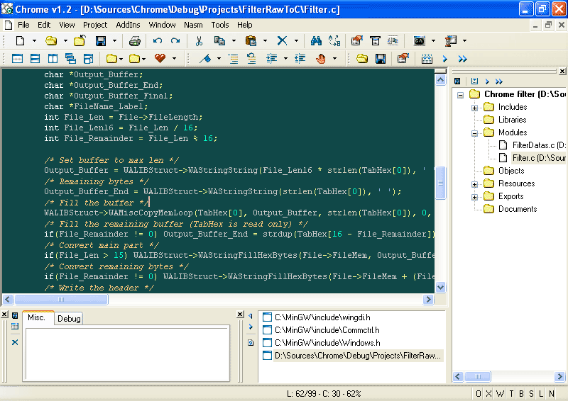

Chromatic is a small and largely outdated IDE for Windows mostly tailored for [MASM32](https://www.masm32.com/)

It's a work in progress since a long time and some (lots of) parts are currently unfinished.

 
 
