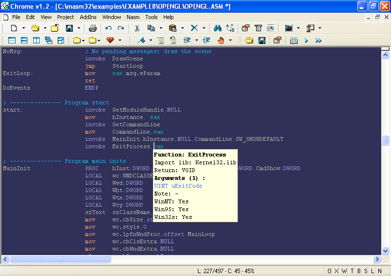

Chromatic IDE is a small and rather obsolete IDE for Windows.

It's a work in progress since a long time and some parts are currently unfinished.

03 June 2022:

- Can now compile again with MSVC6.

09 July 2021:

- Fixed chromatic.rc so the resources can be compiled again.

 
 